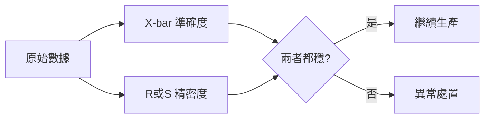

# 📊 雙圖哲學與架構分離

本章節只做一件事：說清楚為什麼 SPC **不能只看一張圖**，以及系統如何把「管理屬性」與「統計運算」拆開。看圖入門見 [`spcDebugging`](../exception-handling/spcDebugging.md)。

## 讀完本篇你能回答

- X-bar 圖與 R/S 圖各自監控什麼？
- 中心對準但波動變大時，單看 X-bar 會漏掉什麼？
- 控制圖（Control Chart）與統計圖表（Statistical Graph）差在哪？

## 1. 雙圖各管一件事

| 圖表 | 監控維度 | 異常意味 |
|------|----------|----------|
| **X-bar**（位置圖） | 製程中心 $\mu$ 是否偏移 | 準確度問題 |
| **R / S**（變異圖） | 組內離散是否變大 | 精密度問題 |

常見陷阱：中心值完全正確，但 $\sigma$ 突然變大——只看 X-bar 會以為沒事。

:::info 實務提醒
**先縮小波動，再校準中心。** R 圖先穩，再調 X-bar 偏移。
:::

## 2. 架構上拆成兩層

| 層級 | 物件 | 放什麼 |
|------|------|--------|
| 管理層 | Control Chart | Owner、部門、USL/LSL |
| 運算層 | Statistical Graph | UCL/LCL 計算、OOC 規則 |

拆開的好處：同一套統計引擎可服務多張管理用控制圖，規則變更也不影響業務歸屬設定。

## 延伸閱讀

| 主題 | 文章 |
|------|------|
| 資料怎麼彙總成點 | [`data-collection`](../engine/data-collection.md) |
| 界限怎麼計算 | [`calculation-engine`](../engine/calculation-engine.md) |
| 判讀規則 | [`decision-rules`](./decision-rules.md) |
| 看圖除錯 | [`spcDebugging`](../exception-handling/spcDebugging.md) |