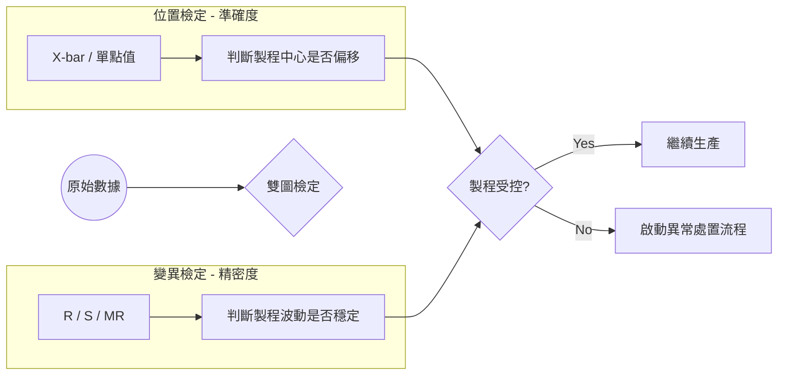

# 📊 雙圖哲學與架構分離

在 SPC 的實務中，單一的數據點無法描述製程的全貌。本章節解析系統如何透過「雙圖結構」解構品質，以及在架構上如何分離「管理意圖」與「數學運算」。

## 1. 架構解耦：控制圖 vs. 統計圖表

為了提升系統的靈活性與可維護性，我們將其設計為兩層架構：

### 1.1 控制圖 (Control Chart) —— 管理容器
- **職責**：定義「監控對象」的管理屬性。
- **核心內容**：責任人 (Owner)、所屬部門、關聯的生產規格 ($USL/LSL$)。

### 1.2 統計圖表 (Statistical Graph) —— 數學引擎
- **職責**：執行純粹的統計運算。
- **核心內容**：管制界限計算 ($UCL/LCL$)、統計判定規則 (OOC Rules)。

## 2. 雙圖哲學：解構「準確度」與「精密度」

專家級的 SPC 監控絕不會只看平均值。製程的穩定性必須從兩個維度同時觀察：

### 2.1 位置圖 (Location Graph) —— 監控中心偏移
- **代表圖表**：平均值圖 ($\bar{X}$ Chart)。
- **偵測對象**：製程的「準確度」。
- **學術意義**：監控製程平均值 ($\mu$) 是否隨時間發生了偏移 (Shift)。

### 2.2 變異圖 (Variation Graph) —— 監控波動穩定
- **代表圖表**：全距圖 ($R$ Chart) 或標準差圖 ($S$ Chart)。
- **偵測對象**：製程的「精密度」。
- **學術意義**：監控製程的離散程度 ($\sigma$)。
- **專家見解**：波動變大通常預示著零件磨損。**先縮小波動，再校準中心**，是製程優化的最高原則。

## 3. 為什麼雙圖必須並存？

考慮以下情境：一個製程的中心值完全正確，但波動劇增 ($\sigma$ 變大)。
- **結論**：雙圖聯動能確保系統同時捕捉到「目標偏移」與「穩定性崩潰」，這是判斷製程健康度的標準。
