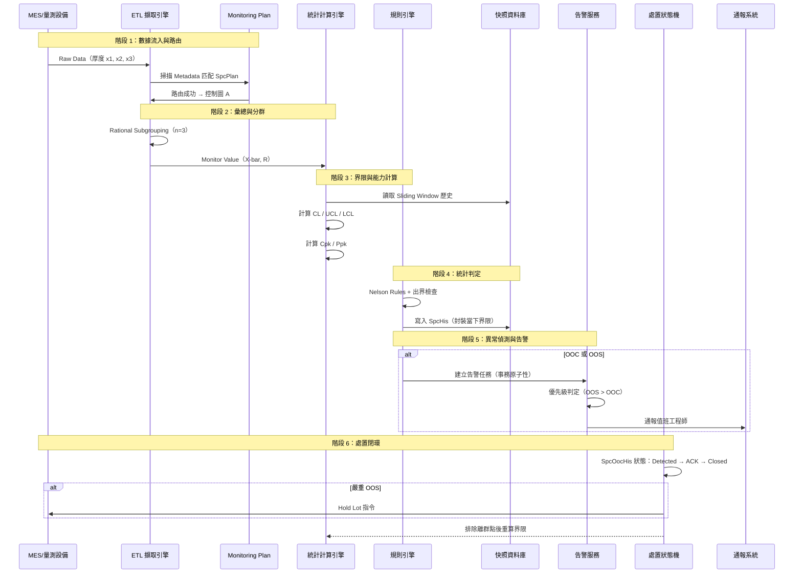

# 📊 端到端資料生命週期

本章節把分散在各模組的文章串成一條故事線：一筆量測數據從 MES/設備流入，經過路由、彙總、計算、判定，最終觸發告警與處置閉環。讀完本篇，你應能向同事描述 SPC 系統的完整資料流。

## 場景設定

- **來源**：蝕刻工序的量測設備，透過 MES 送出厚度 Raw Data
- **監控對象**：Product A × Operation Etch × DataItem Thickness
- **目標**：判定 OOC/OOS、寫入快照、觸發告警、必要時 Hold Lot

## 完整時序圖

## 七個階段說明

### 階段 1：數據流入與路由

量測數據帶有 Product、Operation、DataItem 等 Metadata。Monitoring Plan 依匹配規則決定數據進入哪張控制圖。

- 匹配失敗 → 進入 Pending Pool，不污染歷史界限
- 詳見 [monitoring-strategy](./monitoring-strategy.md)、[monitoring-plan](../engine/monitoring-plan.md)

### 階段 2：理性分群與彙總

原始樣本依 Subgroup 分組，彙總為 X-bar（位置）與 R 或 S（離散）。這些彙總值才是控制圖上的「點」。

- 詳見 [data-collection](../engine/data-collection.md)

### 階段 3：界限與能力計算

計算引擎依 Sliding Window 歷史估算 CL/UCL/LCL，並計算 Cpk（短期）與 Ppk（長期）。

- 詳見 [calculation-engine](../engine/calculation-engine.md)、[dual-chart-philosophy](./dual-chart-philosophy.md)

### 階段 4：統計判定與快照

規則引擎對新點執行 OOC 判定（出界 + Nelson Rules）。寫入 SpcHis 時**封裝當下界限**，確保歷史可還原。

- 詳見 [rule-engine](../engine/rule-engine.md)、[data-snapshot](./data-snapshot.md)

### 階段 5：異常偵測與告警

OOC 與 OOS 兩條路徑並行判定。告警任務與數據寫入在同一事務中，防止遺失。OOS 通常優先於 OOC。

- 詳見 [detection-and-alert](../exception-handling/detection-and-alert.md)、[alert-suppression](../exception-handling/alert-suppression.md)

### 階段 6：處置與 MES 閉環

工程師簽收（ACK）、分析原因、執行 OCAP、結案。嚴重異常可觸發 Hold Lot 或機台停線。

- 詳見 [disposition-state-machine](../exception-handling/disposition-state-machine.md)、[cross-system-integration](../exception-handling/cross-system-integration.md)

### 階段 7：回饋優化

排除離群點、補點重判、配置變更後，系統重算界限與能力指標，形成閉環。

- 詳見 [configuration-management](../engine/configuration-management.md)、[advanced-calculation](../engine/advanced-calculation.md)

## 常見卡關點

| 現象 | 可能原因 | 查哪篇 |
|------|----------|--------|
| 數據進不了控制圖 | Metadata 缺失、Plan 未匹配 | [monitoring-strategy](./monitoring-strategy.md) |
| Cpk 異常低但圖上看正常 | 界限未穩定就開始算能力 | [calculation-engine](../engine/calculation-engine.md) |
| 大量虛警 | 界限過窄或規則過嚴 | [spcDebugging](../exception-handling/spcDebugging.md) |
| 補點觸發連續 OOC | Backfill 重判窗口 | [detection-and-alert](../exception-handling/detection-and-alert.md) |
| 告警漏發 | 事務未封裝或服務中斷 | [notification-reliability](../exception-handling/notification-reliability.md) |

## 與其他文章的關聯

- 學習路徑：[`index`](../index.md)
- 術語表：[`glossary`](../glossary.md)
- 理論基石：[`terminology`](../terminology.md)
- 除錯入門：[`spcDebugging`](../exception-handling/spcDebugging.md)