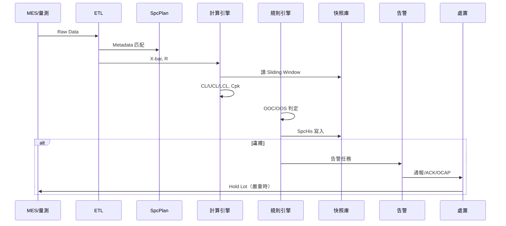

# 📊 端到端資料生命週期

本章節只做一件事：把全系列模組串成**一條故事線**——一筆厚度量測從 MES 流入，到可能觸發 Hold Lot 的完整路徑。各段細節請點延伸閱讀。

## 讀完本篇你能回答

- 一筆 Raw Data 經過哪些系統元件？
- OOC 與 OOS 在哪個階段被判定？
- 工程師 ACK 之後還會發生什麼？

## 場景

- **來源**：蝕刻量測 → MES 送出厚度 Raw Data（$n=3$）
- **監控**：Product A × Etch × Thickness → 控制圖 A

## 完整時序

## 六個階段（對應專文）

| 階段 | 做什麼 | 專文 |
|------|--------|------|
| 1 路由 | Metadata 匹配 SpcPlan | [`monitoring-strategy`](./monitoring-strategy.md) |
| 2 彙總 | Subgroup → X-bar, R | [`data-collection`](../engine/data-collection.md) |
| 3 計算 | 界限與 Cpk/Ppk | [`calculation-engine`](../engine/calculation-engine.md) |
| 4 判定 | Nelson + 出界 → SpcHis | [`rule-engine`](../engine/rule-engine.md) |
| 5 告警 | 事務性任務、優先級 | [`detection-and-alert`](../exception-handling/detection-and-alert.md) |
| 6 閉環 | ACK → OCAP → Hold | [`disposition-state-machine`](../exception-handling/disposition-state-machine.md) |

## 常見卡關點

| 現象 | 查哪篇 |
|------|--------|
| 數據進不了圖 | [`monitoring-plan`](../engine/monitoring-plan.md) |
| Cpk 怪但圖正常 | [`calculation-engine`](../engine/calculation-engine.md) |
| 大量虛警 | [`spcDebugging`](../exception-handling/spcDebugging.md) |
| 補點連續 OOC | [`detection-and-alert`](../exception-handling/detection-and-alert.md) |
| 告警漏發 | [`notification-reliability`](../exception-handling/notification-reliability.md) |

## 延伸閱讀

| 主題 | 文章 |
|------|------|
| 學習路徑 | [`index`](../index.md) |
| 理論入門 | [`terminology`](../terminology.md) |
| 術語速查 | [`glossary`](../glossary.md) |