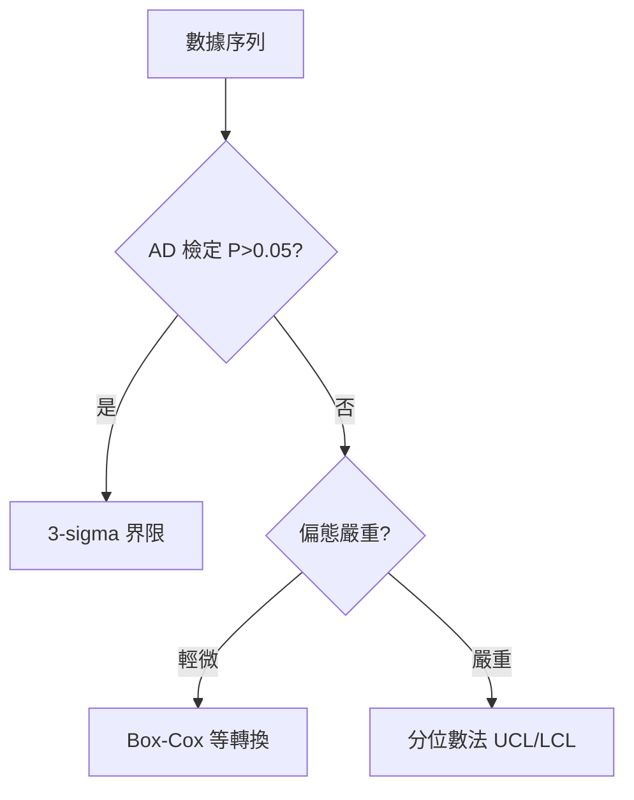

# 📊 進階計算機制

本章節只做一件事：說明當數據**不符合常態**或**規模極大**時，計算引擎的應對策略。基礎界限算法見 [`calculation-engine`](./calculation-engine.md)。

## 讀完本篇你能回答

- 什麼時候不能用 $3\sigma$ 算界限？
- 分位數法怎麼取代 UCL/LCL？
- 補點進來後為什麼要重判 OOC？

## 1. 非常態數據

標準 SPC 假設常態分佈。偏態或雙峰時：

| 方法 | 說明 |
|------|------|
| AD 檢定 | $P < 0.05$ 判定非常態 |
| 分位數法 | $UCL$=99.865th、$LCL$=0.135th，維持等機率報警 |

## 2. 效能設計

| 機制 | 目的 |
|------|------|
| 事件驅動異步計算 | 寫入不阻塞，背景算界限 |
| 記憶體快取 + 增量統計 | 減少全表掃描 |
| Scale-out + 熔斷 | 單點異常不拖垮全廠 |

## 3. 補點與重判

- 新點（含延遲 Backfill）進入 → 重掃受影響的滑動窗口
- **已簽核界限**鎖定不變，補點只觸發判定、不自動改界

## 延伸閱讀

| 主題 | 文章 |
|------|------|
| 基礎計算 | [`calculation-engine`](./calculation-engine.md) |
| 規則重判 | [`rule-engine`](./rule-engine.md) |
| 快照 | [`data-snapshot`](../core-model/data-snapshot.md) |