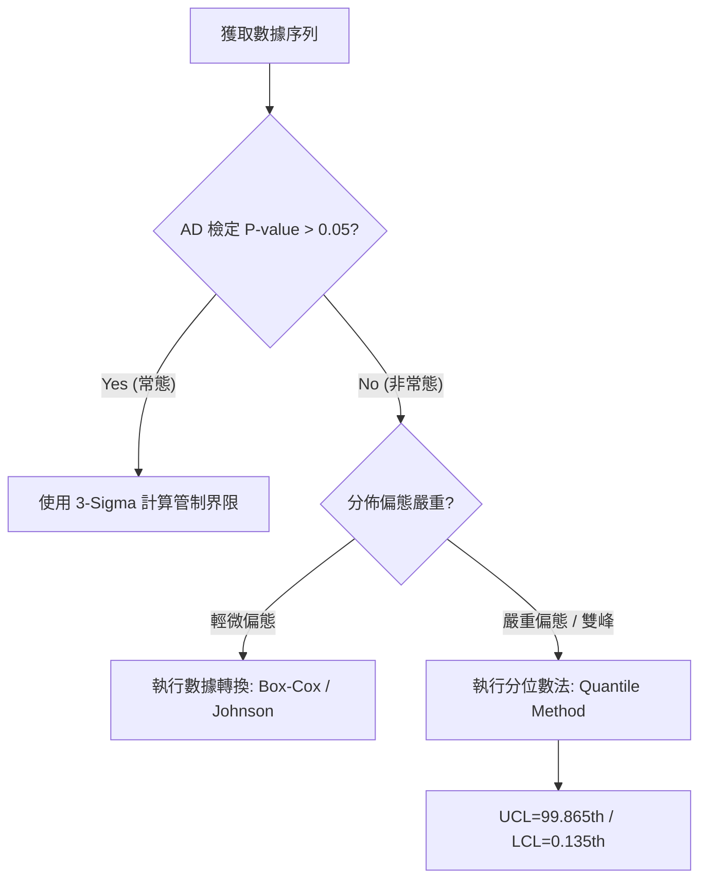

# 📊 進階計算機制

本章節探討 SPC 系統在應對真實生產環境中的兩大挑戰：**非對稱數據分佈**與**極大規模並發計算**。

## 1. 非常態分佈 (Non-normality) 處理

標準的 SPC 理論假設數據呈現常態分佈。但在特定製程中，數據往往呈現單側偏態。

### 📊 實務決策：非常態數據處理路徑

### 1.1 Anderson-Darling (AD) 檢定
- **門檻值**：當 $P\text{-value} < 0.05$ 時，系統判定數據為「非常態」。

### 1.2 分位數法 (Quantile Method)
- **原理**：直接利用數據分佈的分位點。
  $$UCL = \text{Quantile}(99.865\%)$$
  $$LCL = \text{Quantile}(0.135\%)$$
- **設計理由**：確保兩側的報警機率與常態分佈一致，實現「等機率界限」。

## 2. 異步計算引擎與高性能設計

### 2.1 事件驅動架構
- **工作流**：數據寫入後發送「計算事件」至背景執行緒池。
- **優勢**：前台操作非阻塞，極大化吞吐量。

### 2.2 緩存策略與增量計算
- **Memory-cache**：將歷史觀測值快取在記憶體中。
- **增量統計**：針對總平均值，系統僅計算「差量」，減少掃描開銷。

## 3. 延遲數據與歷史重判

- **重判邏輯**：新點進入後，自動遞迴掃描受影響的滑動窗口，重新標記 OOC 狀態。
- **界限鎖定機制**：已簽核界限不可自動更新，補入數據僅觸發判定。

## 4. 領域專家思維：系統擴展性

系統支援橫向擴展 (Scale-out)，並具備「計算熔斷機制」，確保全廠監控環境不會因單一異常點而崩潰。
