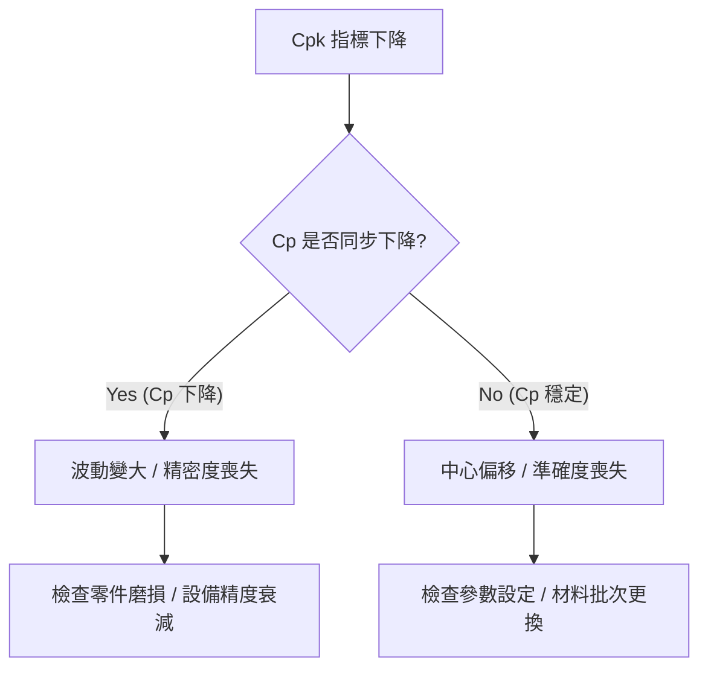

# 📊 統計計算引擎

本章節介紹 SPC 系統的核心運算邏輯：如何依據歷史數據估算管制界限，以及如何量化製程與規格之間的適配度。

## 1. 管制界限 (Control Limits) 的統計估算策略

中心線 ($CL$) 與管制界限 ($UCL/LCL$) 反映了製程的自然波動區間。

### 1.1 平均值圖的管制界限
- **公式**：
  $$CL = \bar{\bar{X}}$$
  $$UCL = \bar{\bar{X}} + A_2 \bar{R}$$
  $$LCL = \bar{\bar{X}} - A_2 \bar{R}$$
- **設計邏輯**：透過全距平均值 ($\bar{R}$) 與係數 ($A_2$) 來估算組內標準差 $\sigma$。

## 2. 短期與長期能力：$\sigma_{\text{within}}$ vs. $\sigma_{\text{overall}}$

### 2.1 組內變異 ($\sigma_{\text{within}}$) —— 計算 $C_{pk}$
- **公式**：
  $$\hat{\sigma}_{\text{within}} = \frac{\bar{R}}{d_2} \text{ 或 } \frac{\bar{S}}{c_4}$$
- **學術意義**：反映製程在「理想、受控」狀態下的**潛在能力**。

### 2.2 整體變異 ($\sigma_{\text{overall}}$) —— 計算 $P_{pk}$
- **公式**：採用所有數據點計算的樣本標準差。
- **學術意義**：代表客戶收到的產品**真實表現**。

## 3. 製程能力指標 (PCI) 的判讀

### 📊 指標選擇：Cpk vs. Ppk 判斷表

| 場景 | 使用指標 | 統計意義 | 決策目的 |
| :--- | :--- | :--- | :--- |
| **評估設備技術極限** | **Cpk** | 基於 $\sigma_{\text{within}}$ | 判斷機台「潛力」 |
| **評估客戶收貨風險** | **Ppk** | 基於 $\sigma_{\text{overall}}$ | 判斷真實良率 |
| **判斷製程穩定性** | **Cpk / Ppk 差異** | 指標落差 | 若 $C_{pk} \gg P_{pk}$，代表中心隨時間大幅漂移 |

### 📊 實戰決策：Cpk 下降診斷樹

## 4. 領域專家思維：PCI 指標與商業決策

專家不應只追求極高的 $C_{pk}$。
- **成本平衡**：盲目提升 $C_{pk}$ 可能會大幅增加量測成本。
- **動態調整**：系統支援在界限發布前進行「模擬檢核」，輔助決策。
