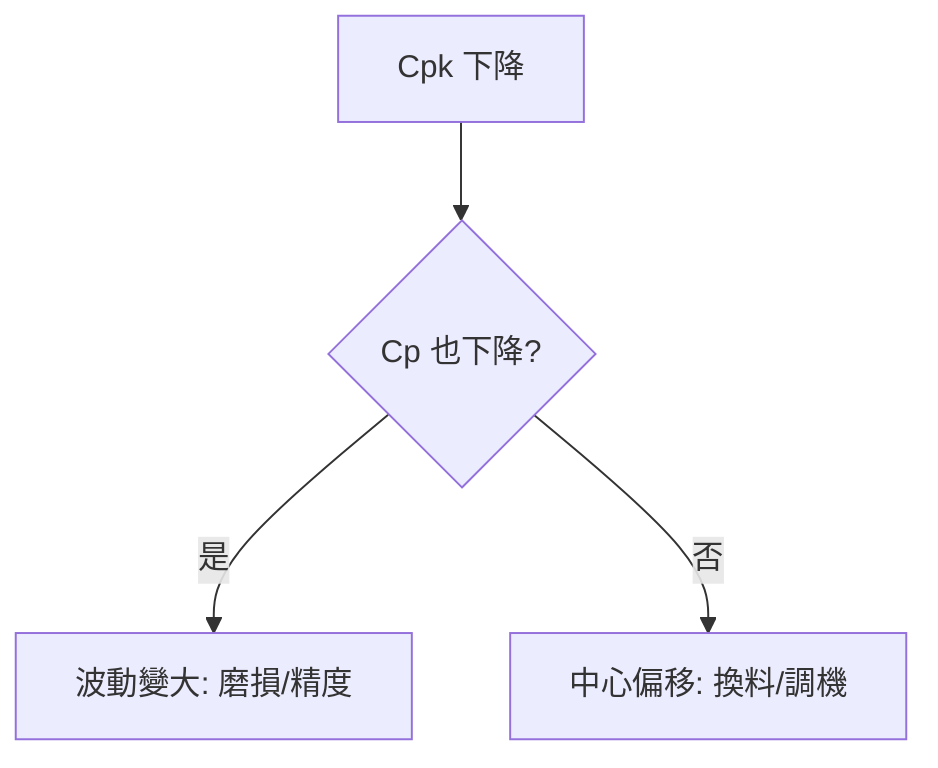

# 📊 統計計算引擎

本章節只做一件事：說明計算引擎如何從歷史數據得出 **CL/UCL/LCL** 與 **Cpk/Ppk**。概念入門見 [`terminology`](../terminology.md)。

## 讀完本篇你能回答

- X-bar 圖的 UCL/LCL 怎麼從 $\bar{R}$ 推出？
- Cpk 與 Ppk 用的 $\sigma$ 有何不同？
- Cpk 下降時，怎麼判斷是波動變大還是中心偏移？

## 1. 管制界限（X-bar 圖）

$$CL = \bar{\bar{X}}, \quad UCL/LCL = \bar{\bar{X}} \pm A_2 \bar{R}$$

透過 $\bar{R}$ 與係數 $A_2$ 估計組內 $\sigma$，反映製程自然波動區間。

## 2. 兩種 σ

| 符號 | 估計方式 | 用於 |
|------|----------|------|
| $\sigma_{\text{within}}$ | $\bar{R}/d_2$ 或 $\bar{S}/c_4$ | **Cpk**（短期能力） |
| $\sigma_{\text{overall}}$ | 全體樣本標準差 | **Ppk**（長期表現） |

$C_{pk} \gg P_{pk}$ 通常代表中心隨時間漂移明顯。

## 3. 指標怎麼選

| 目的 | 用哪個 |
|------|--------|
| 評估機台潛力 | Cpk |
| 評估客戶收貨風險 | Ppk |
| 看穩定性落差 | Cpk − Ppk |

## 4. Cpk 下降診斷

:::info 實務提醒
不應盲目追求極高 Cpk——量測成本與抽樣頻率也要納入決策。發布新界限前可做模擬檢核。
:::

## 延伸閱讀

| 主題 | 文章 |
|------|------|
| 界限概念 | [`control-vs-spec-limits`](../core-model/control-vs-spec-limits.md) |
| 資料彙總 | [`data-collection`](./data-collection.md) |
| 非常態處理 | [`advanced-calculation`](./advanced-calculation.md) |
| 除錯 | [`spcDebugging`](../exception-handling/spcDebugging.md) |