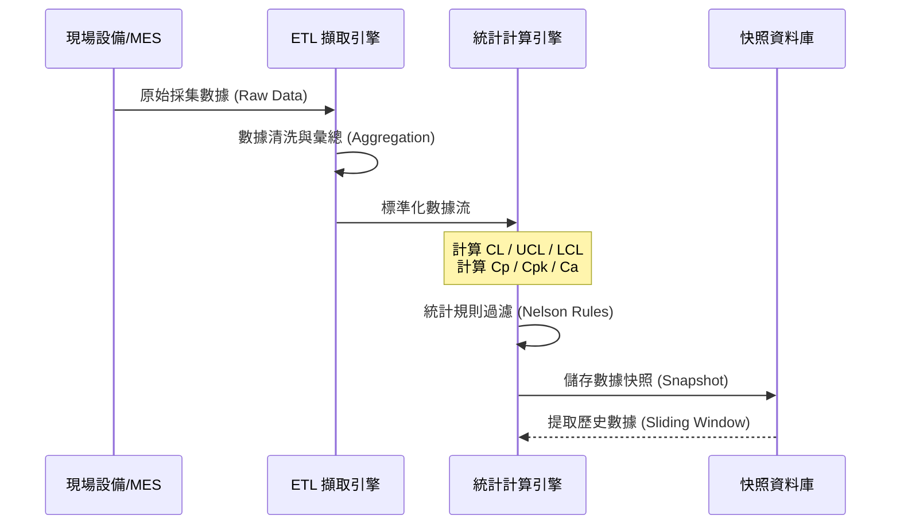

# 📊 資料擷取與彙總架構

本章節解析數據進入系統後的初步處理流程。在半導體製造中，我們面臨海量的原始數據，如何「理性地彙總」是統計分析的第一步。

## 1. 數據分層模型：原始樣本 vs. 觀測彙總值

為了兼顧儲存效率與分析深度，系統建立了雙層數據模型：

### 1.1 原始樣本 (Raw Samples)
- **定義**：直接從量測設備獲取的物理數值。
- **儲存價值**：保留原始樣本是為了計算「組內變異」以及後續的診斷。

### 1.2 觀測彙總值 (Monitor Value)
- **定義**：對一組樣本進行數學彙總後的單一數值，這也是控制圖上實際呈現的「點」。
- **彙總類型**：
    - **位置估計 (Location Estimate)**：通常為樣本平均值 $\bar{X} = \frac{\sum x_i}{n}$。
    - **離散估計 (Variation Estimate)**：反映數據的散佈程度。

## 2. 離散估計量的選擇邏輯：$R$ vs. $S$

系統會根據樣本數 $n$ 自動調整估計方法：

### 2.1 全距 (Range, $R$)
- **公式**：
  $$R = X_{\text{max}} - X_{\text{min}}$$
- **適用場景**：樣本數 $n < 10$。

### 2.2 標準差 (Standard Deviation, $S$)
- **公式**：
  $$S = \sqrt{\frac{\sum (x_i - \bar{x})^2}{n-1}}$$
- **適用場景**：樣本數 $n \geq 10$。

## 3. 動態樣本數處理

- **係數補償**：系統會動態查找統計常數表。
- **加權中心線**：當各組 $n$ 不同時，中心線 $\bar{\bar{X}}$ 採用加權平均計算：
  $$\bar{\bar{X}} = \frac{\sum (n_i \cdot \bar{x}_i)}{\sum n_i}$$

## 4. 領域專家思維：採樣的時效性

專家在設定彙總策略時會考慮「時間相關性」。系統支援「強制分組截斷」，確保每一組數據都具備物理上的同質性。
