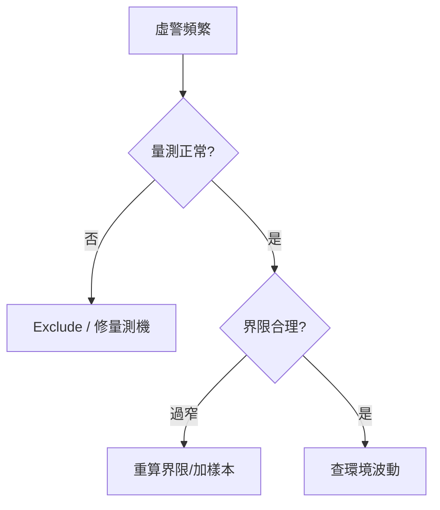

# 📊 告警抑制與通報策略

本章節只做一件事：說明如何在**不漏重大異常**的前提下，避免告警疲勞。偵測入口見 [`detection-and-alert`](./detection-and-alert.md)。

## 讀完本篇你能回答

- 10 分鐘內連續 OOC 為什麼不該發 10 則通報？
- 工程師 ACK 前通報如何升級？
- 懷疑虛警時先查什麼？

## 1. 告警歸併

同一 Plan、同一圖表、同類異常，在時間窗口（如 10 分鐘）內歸併到首發紀錄，不重複建通報任務。

## 2. 時間窗口抑制

支援「X 小時內同機台不重複通報」，給工程師修復緩衝。

## 3. 階層升級

| 層級 | 觸發 |
|------|------|
| 值班工程師 | 立即 |
| 一線主管 | 30 分鐘未 ACK |
| 部門經理 | 2 小時未處理 |

## 4. 虛警快速排查

通報內容應含 $\Delta\mu$、當前 $C_{pk}$、機台 ID，提升信噪比。

## 延伸閱讀

| 主題 | 文章 |
|------|------|
| 異常偵測 | [`detection-and-alert`](./detection-and-alert.md) |
| 通報可靠性 | [`notification-reliability`](./notification-reliability.md) |
| 除錯入門 | [`spcDebugging`](./spcDebugging.md) |