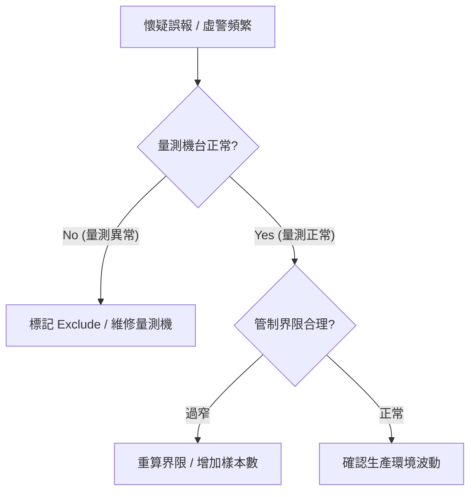

# 📊 告警抑制與通報策略

本章節解析系統如何對告警任務進行「智慧過濾」。在自動化生產線中，必須防止「告警疲勞」，確保重大異常不被淹沒。

## 1. 告警歸併算法 (Alarm Consolidation)

- **維度聚合**：針對同一計畫、同一圖表的相同類別異常。
- **歸併動作**：在特定時間窗口（如 $10$ 分鐘）內，將後續異常鏈結至首發紀錄下，不產生重複通報任務。

### 📊 實務診斷：告警誤報排查樹

## 2. 時間窗口抑制

- **策略設定**：支持「$X$ 小時內不重複通報相同機台」。
- **修復緩衝**：給予工程師足夠時間修復，期間的重複異常不重複觸發通報。

## 3. 階層式通報與升級 (Escalation)

- **第一層**：值班工程師（立即通報）。
- **第二層**：一線主管（30 分鐘未 ACK 補發）。
- **第三層**：部門經理（2 小時未處理觸發）。

## 4. 領域專家思維：告警信噪比

專家深知，最好的通報是「極少且極精確」。
- **自定義模板**：包含偏移量 $\Delta \mu$、當前 $C_{pk}$、關聯機台等關鍵資訊。
- **統計優化**：定期分析通報頻率，調優界限與窗口。
