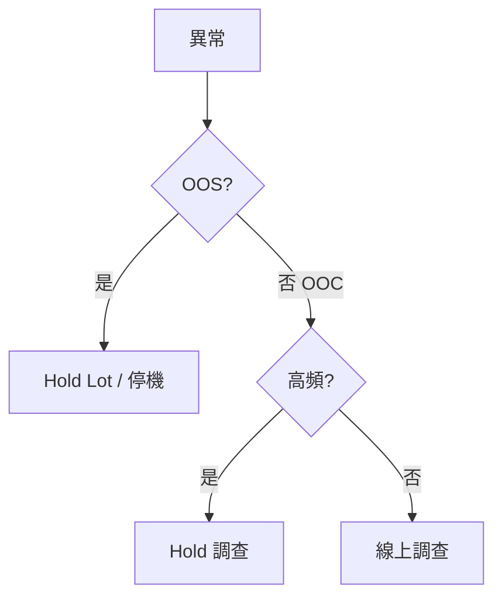

# 📊 跨系統聯動處置

本章節只做一件事：說明統計判定如何變成 MES 上的**物理攔截**（Hold Lot / 停線）。決策樹與成本平衡如下。

## 讀完本篇你能回答

- OOS 與高頻 OOC 各該怎麼處置？
- SPC 與 MES 通訊失敗怎麼辦？
- False Block 如何控制？

## 1. Hold 決策

指令經 Web Service / MQ / TIBCO 送出，含 Lot ID、原因碼、分析摘要。

## 2. 雙向握手

SPC 等待 MES ACK；失敗則走備援通報，請工程師手動攔截。

## 3. Entity Block

系統性機台異常可 Chamber Block，復機需品質簽核解除。

:::info 實務提醒
採三級處置平衡產能：Warning → Track In Monitor → Hard Hold。過敏會造成 False Block 產能損失。
:::

## 延伸閱讀

| 主題 | 文章 |
|------|------|
| 異常偵測 | [`detection-and-alert`](./detection-and-alert.md) |
| 處置狀態機 | [`disposition-state-machine`](./disposition-state-machine.md) |
| 端到端流程 | [`endToEndLifecycle`](../core-model/endToEndLifecycle.md) |