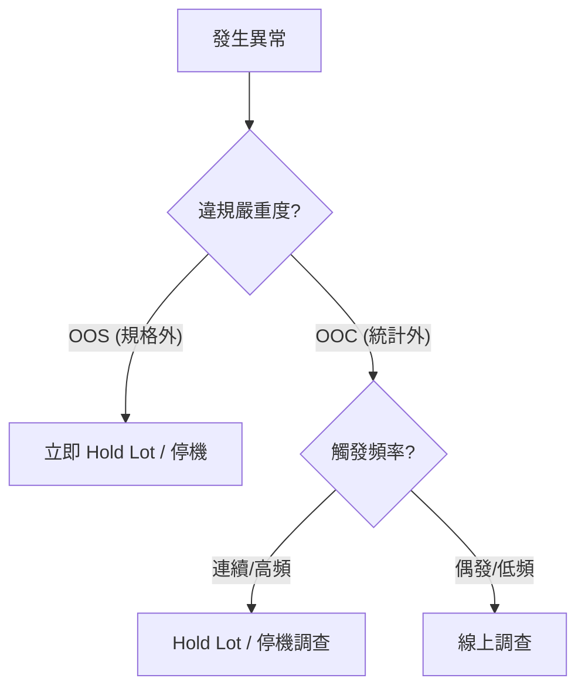

# 📊 跨系統聯動處置

本章節介紹 SPC 系統如何將「統計判定」轉化為「生產線阻斷」動作。這是半導體品質管理的最後一道物理防線。

## 1. 自動 Hold Lot 指令

### 📊 實務決策：何時停產 (Hold) vs. 調查

- **通訊方式**：透過 Web Service、MQ 或 TIBCO 與 MES 聯動。
- **指令內容**：包含 Lot ID、原因碼及分析數據。

## 2. 雙向握手與可靠性 (Two-way Handshake)

- **同步 ACK**：SPC 發送指令後等待 MES 回饋執行結果。
- **異常補償**：若通訊失敗，自動轉向「備援管道」通知工程師手動攔截。

## 3. 機台預防性停線 (Entity Block)

- **邏輯**：偵測到機台系統性異常時，下達 Chamber Block 指令。
- **復機流程**：機台鎖定派工，直到工程師執行「品質解除」簽核。

## 4. 領域專家思維：成本與品質的平衡

- **False Block 成本**：過於靈敏會導致產能損失。
- **層級化處置**：
    - **輕微**：僅發送 Warning。
    - **中度**：標記為 Track In Monitor。
    - **嚴重**：執行 Hard Hold。
透過階層化管理，專家能實現在「保障品質」與「極大化產能」之間的動態平衡。
