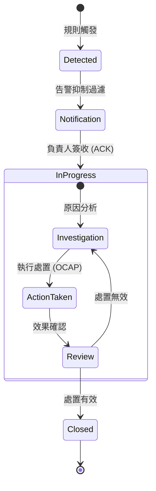

# 📊 異常處置狀態機

本章節解析異常紀錄的持久化模型。在我們的系統中，異常點是具備狀態屬性的管理對象。

## 1. 異常紀錄狀態流 (State Transitions)

- **NEW**：偵測違規後的初始狀態。
- **ACK**：工程師簽收，停止通報升級。
- **ANALYZING**：調查異常原因中。
- **CLOSED**：填寫處置動作後正式結案。

## 2. 根因分類與原因代碼

強制對異常進行歸類：
- **Common Cause**：製程內在波動。
- **Special Cause**：明確的外部干擾。
- **分析價值**：透過原因代碼分佈（柏拉圖分析）鎖定品質波動主因。

## 3. 數據排除與重算效應

- **排除操作**：若確認為量測機台故障，可將點標記為 `Excluded`。
- **自動重算**：觸發影子計算，剔除該點並重估 $C_{pk}$，確保基線純淨。

## 4. 領域專家思維：OCAP 標準化

- **強制註記**：結案前檢查處置代碼與分析內容。
- **流程稽核**：紀錄「誰、何時、執行什麼變更」，滿足回溯需求。
