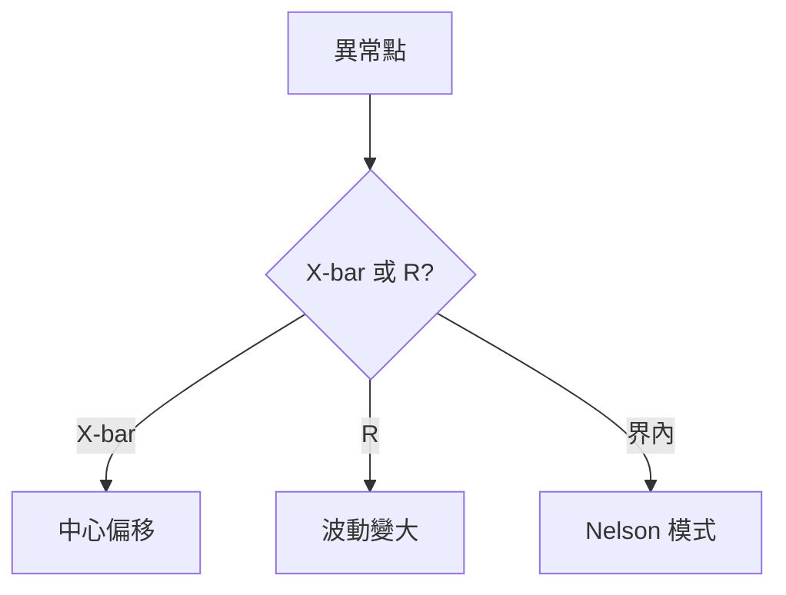

# 📊 看圖與除錯入門

本章節只做一件事：給品保/工程師一份**現場除錯速查**——如何讀雙圖、分層排查虛警。不需會寫統計引擎。

## 讀完本篇你能回答

- X-bar 出界和 R 出界各該查什麼？
- OOC only、OOS only、兩者皆有時優先級？
- 五個最常見虛警怎麼判斷？

## 1. 五分鐘讀雙圖

| 圖 | 看什麼 | 異常意味 |
|----|--------|----------|
| X-bar | UCL/LCL、偏移/趨勢 | 中心跑了 |
| R/S | 組內離散變大 | 波動變大 |

口訣：X-bar 想「停哪」；R 想「車變寬沒」。詳見 [`dual-chart-philosophy`](../core-model/dual-chart-philosophy.md)。

## 2. OOC vs OOS

| 情況 | 產品 | 製程 | 動作 |
|------|------|------|------|
| OOC only | 可能合格 | 不穩 | 預防介入 |
| OOS only | 不合格 | 可能受控 | 隔離批次 |
| 兩者 | 不合格 | 不穩 | Hold 評估 |

## 3. 五個常見虛警

| # | 症狀 | 先查 |
|---|------|------|
| 1 | 改規格後大量 OOS | [`configuration-management`](../engine/configuration-management.md) |
| 2 | 數據進不了圖 | [`monitoring-plan`](../engine/monitoring-plan.md) Pending |
| 3 | 界限狂跳、Cpk 不穩 | TRIAL→ACTIVE？樣本數？ |
| 4 | 補點後連續 OOC | Backfill Alert，通常不 Hold |
| 5 | 告警沒了但 OOS 還有 | 是否手動拉寬界限 |

## 4. 分層除錯

| 層 | 查什麼 | 文章 |
|----|--------|------|
| 數據 | 量測、路由 | [`data-collection`](../engine/data-collection.md) |
| 統計 | 界限、Cpk | [`calculation-engine`](../engine/calculation-engine.md) |
| 告警 | 抑制、歸併 | [`alert-suppression`](./alert-suppression.md) |
| 處置 | ACK、OCAP | [`disposition-state-machine`](./disposition-state-machine.md) |

## 延伸閱讀

| 主題 | 文章 |
|------|------|
| 學習路徑 | [`index`](../index.md) |
| 端到端流程 | [`endToEndLifecycle`](../core-model/endToEndLifecycle.md) |
| 術語速查 | [`glossary`](../glossary.md) |