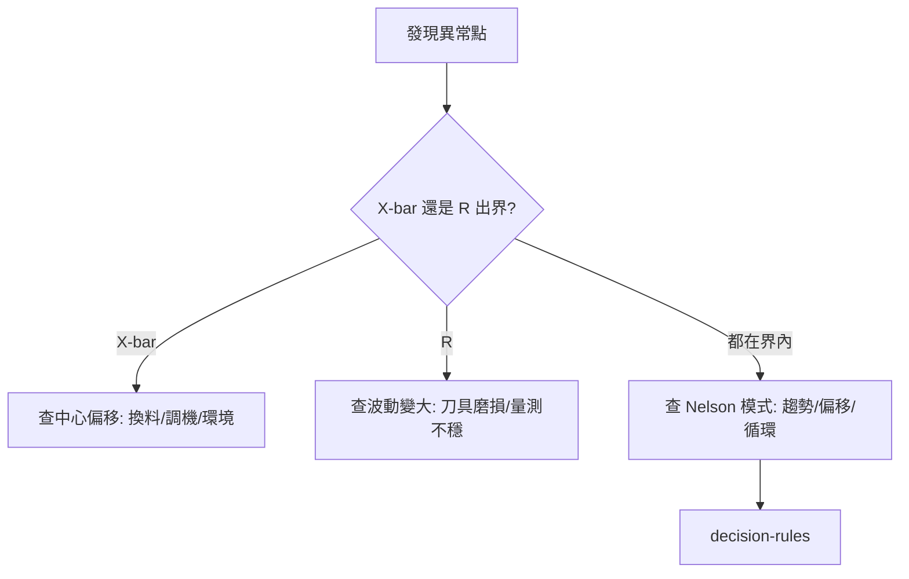
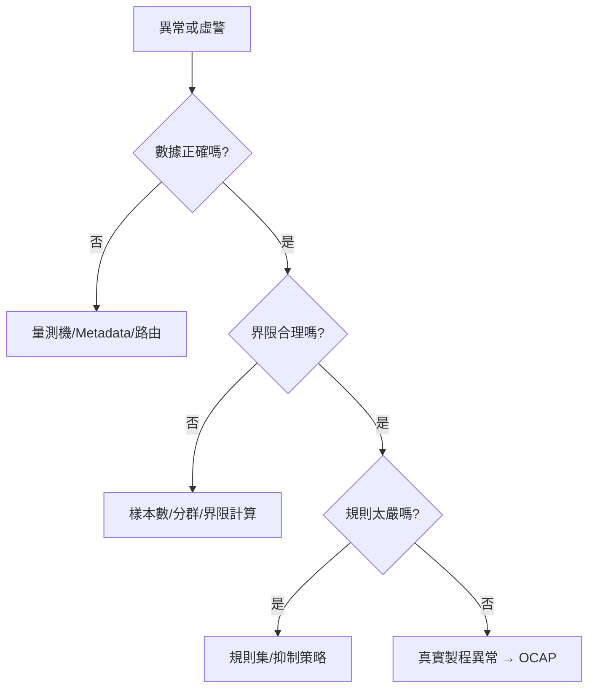

# 📊 看圖與除錯入門

本章節提供淺層實務導讀：如何快速判讀 X-bar / R 雙圖、如何區分 OOC 與 OOS、以及五個最常見的虛警情境。目標是讓你能參與現場除錯對話，而非自行開發統計引擎。

## 五分鐘讀懂 X-bar / R 雙圖

| 圖表 | 看什麼 | 異常代表什麼 |
|------|--------|-------------|
| **X-bar** | 點是否超出 UCL/LCL，或有連續偏移/趨勢 | 製程**中心**跑了（準確度問題） |
| **R（或 S）** | 組內離散是否變大 | 製程**波動**變大（精密度問題） |

**專家口訣：** X-bar 出界先想「停哪裡」；R 出界先想「車子變寬了」。兩張圖必須同時看，詳見 [dual-chart-philosophy](../core-model/dual-chart-philosophy.md)。

## OOC vs OOS 除錯決策

| 類型 | 產品合格嗎 | 製程穩定嗎 | 優先動作 |
|------|-----------|-----------|----------|
| **OOC only** | 可能仍合格 | 不穩定 | 查製程原因，預防惡化 |
| **OOS only** | 不合格 | 可能仍受控 | 隔離批次，查規格與能力 |
| **OOC + OOS** | 不合格 | 不穩定 | 最高優先，Hold Lot + 停線評估 |

詳見 [control-vs-spec-limits](../core-model/control-vs-spec-limits.md)、[detection-and-alert](./detection-and-alert.md)。

## 五個常見虛警情境

### 1. 規格界限改動

| 症狀 | USL/LSL 調整後大量 OOS |
|------|------------------------|
| 原因 | 規格變了但歷史界限未重算 |
| 排查 | 確認配置變更紀錄，見 [configuration-management](../engine/configuration-management.md) |

### 2. Plan 路由失敗

| 症狀 | 數據進不了控制圖，或進錯圖 |
|------|---------------------------|
| 原因 | Metadata 缺失、Wildcard 匹配錯誤 |
| 排查 | 查 Pending Pool，見 [monitoring-plan](../engine/monitoring-plan.md) |

### 3. 樣本數不足

| 症狀 | 界限跳動劇烈、Cpk 不穩定 |
|------|-------------------------|
| 原因 | Subgroup n 太小或歷史點太少 |
| 排查 | 確認 TRIAL 階段是否已切 ACTIVE，見 [monitoring-strategy](../core-model/monitoring-strategy.md) |

### 4. 補點 Backfill

| 症狀 | 歷史區間突然出現連續 OOC |
|------|-------------------------|
| 原因 | 延遲數據回填觸發滑動窗口重判 |
| 排查 | 告警標記為 Backfill Alert，通常不 Hold Lot，見 [detection-and-alert](./detection-and-alert.md) |

### 5. 手動調寬管制界限

| 症狀 | 告警消失但 OOS 仍發生 |
|------|----------------------|
| 原因 | 人為把 UCL/LCL 拉寬，掩蓋真實不穩定 |
| 排查 | 界限必須由統計引擎自動計算，見 [control-vs-spec-limits](../core-model/control-vs-spec-limits.md) |

## 分層除錯策略

| 層級 | 查什麼 | 對應文章 |
|------|--------|----------|
| 數據層 | Raw Data、路由、Pending | [data-collection](../engine/data-collection.md) |
| 統計層 | CL/UCL/LCL、Cpk、雙圖 | [calculation-engine](../engine/calculation-engine.md) |
| 告警層 | 優先級、抑制、歸併 | [alert-suppression](./alert-suppression.md) |
| 處置層 | ACK、OCAP、Hold Lot | [disposition-state-machine](./disposition-state-machine.md) |

## 實務建議

- 先看**雙圖**再看 Cpk 數字（基礎不穩時 Cpk 無意義）
- 保留完整 SpcHis 快照，爭議時可還原當時界限
- 術語不熟時查 [glossary](../glossary.md)
- 完整流程對照 [endToEndLifecycle](../core-model/endToEndLifecycle.md)

## 與其他文章的關聯

- 學習路徑：[`index`](../index.md)
- 端到端場景：[`endToEndLifecycle`](../core-model/endToEndLifecycle.md)
- 判讀規則：[`decision-rules`](../core-model/decision-rules.md)
- 告警抑制：[`alert-suppression`](./alert-suppression.md)