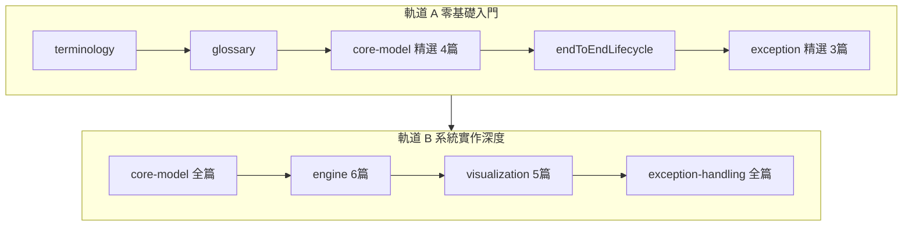

# 📊 SPC 學習路徑

本章節是 SPC 系列的導航首頁。本文件庫同時服務**零基礎讀者**與**開發者/架構師**——依你的目標選擇閱讀軌道。

## 適用對象

- **軌道 A**：剛接觸 SPC、品保工程師、需讀懂控制圖與 OOC 的讀者
- **軌道 B**：SPC 系統開發者、架構師，需設計 ETL、計算引擎、異常閉環

**先修知識：無。** 軌道 A 從 [`terminology`](./terminology.md) 的車庫比喻講起。

## 雙軌路徑總覽

---

## 軌道 A：零基礎入門（約 12 步）

| 順序 | 文章 | 讀完能回答 |
|------|------|-----------|
| 1 | [基礎理論與名詞解釋](./terminology.md) | SPC 是什麼？Cp/Cpk、OOC/OOS 差異？ |
| 2 | [快速術語表](./glossary.md) | UCL、Subgroup、OCAP 各代表什麼？ |
| 3 | [管制界限與規格界限](./core-model/control-vs-spec-limits.md) | 管制界限 vs 規格界限？ |
| 4 | [雙圖哲學](./core-model/dual-chart-philosophy.md) | 為什麼要看 X-bar 和 R 兩張圖？ |
| 5 | [判讀規則](./core-model/decision-rules.md) | 不出界也算異常嗎？ |
| 6 | [端到端資料生命週期](./core-model/endToEndLifecycle.md) | 一筆量測數據怎麼走完系統？ |
| 7 | [異常偵測與告警](./exception-handling/detection-and-alert.md) | OOC 和 OOS 怎麼觸發告警？ |
| 8 | [異常處置狀態機](./exception-handling/disposition-state-machine.md) | 異常點怎麼被處置結案？ |
| 9 | [看圖與除錯入門](./exception-handling/spcDebugging.md) | 虛警、補點、路由失敗怎麼判斷？ |
| 選讀 | [高階統計圖表](./visualization/advanced-charts.md) | 直方圖、盒鬚圖什麼時候用？ |

### 軌道 A 讀完後，你應該能

- 區分 OOC（統計不穩）與 OOS（產品不合格）
- 判讀 X-bar / R 雙圖的基本異常模式
- 描述資料從量測 → 路由 → 計算 → 告警 → 處置的完整流程
- 參與現場虛警除錯對話

---

## 軌道 B：系統實作深度（入門後延伸）

完成軌道 A 後，依模組深入閱讀。

### 核心領域模型

| 文章 | 主題 |
|------|------|
| [監控策略與分群架構](./core-model/monitoring-strategy.md) | SpcPlan、理性分群 |
| [雙圖哲學與架構分離](./core-model/dual-chart-philosophy.md) | 控制圖 vs 統計圖表 |
| [管制界限與規格界限](./core-model/control-vs-spec-limits.md) | UCL/LCL vs USL/LSL |
| [判讀規則與模式識別](./core-model/decision-rules.md) | Nelson Rules、模式偵測 |
| [數據快照與異常處置](./core-model/data-snapshot.md) | SpcHis、SpcOocHis |
| [端到端資料生命週期](./core-model/endToEndLifecycle.md) | 全流程總結 |

### 資料擷取與計算引擎

| 文章 | 主題 |
|------|------|
| [資料擷取與彙總架構](./engine/data-collection.md) | Raw Sample、Monitor Value |
| [統計計算引擎](./engine/calculation-engine.md) | CL/UCL/LCL、Cpk/Ppk |
| [進階計算機制](./engine/advanced-calculation.md) | 非常態、異步重判 |
| [監控計畫與路由引擎](./engine/monitoring-plan.md) | Domain 匹配 |
| [統計規則引擎](./engine/rule-engine.md) | 滑動窗口、位元遮罩 |
| [配置變更管理](./engine/configuration-management.md) | 版本化、影響評估 |

### 數據視覺化

| 文章 | 主題 |
|------|------|
| [圖層分離與高效渲染](./visualization/layer-rendering.md) | ChartDirector、LOD |
| [海量數據採樣策略](./visualization/data-sampling.md) | LTTB 算法 |
| [深度下鑽與互動分析](./visualization/drill-down.md) | 三層分析路徑 |
| [高階統計圖表分析](./visualization/advanced-charts.md) | 直方圖、盒鬚圖 |
| [報表自動化系統](./visualization/report-automation.md) | 定時報表 |

### 異常處理

| 文章 | 主題 |
|------|------|
| [異常偵測與告警觸發](./exception-handling/detection-and-alert.md) | OOC/OOS 原子性 |
| [告警抑制與通報策略](./exception-handling/alert-suppression.md) | 歸併、升級 |
| [異常處置狀態機](./exception-handling/disposition-state-machine.md) | OCAP 生命週期 |
| [跨系統聯動處置](./exception-handling/cross-system-integration.md) | Hold Lot、停線 |
| [通報可靠性與補償機制](./exception-handling/notification-reliability.md) | 零丟失 |
| [看圖與除錯入門](./exception-handling/spcDebugging.md) | 虛警排查 |

### 軌道 B 讀完後，你應該能

- 設計 ETL 彙總與 Monitoring Plan 路由
- 實作統計計算與規則引擎的架構取捨
- 規劃視覺化渲染與海量數據採樣
- 設計異常閉環（告警 → 處置 → MES 聯動）

---

## 本系列不涵蓋

- 統計學教科書級公式推導
- 各廠 MES / 量測設備介面差異
- ChartDirector 或前端圖表庫的 API 實作細節

## 快速查詢

- 不懂縮寫？→ [術語表](./glossary.md)
- 想看完整流程？→ [端到端資料生命週期](./core-model/endToEndLifecycle.md)
- 現場虛警？→ [看圖與除錯入門](./exception-handling/spcDebugging.md)