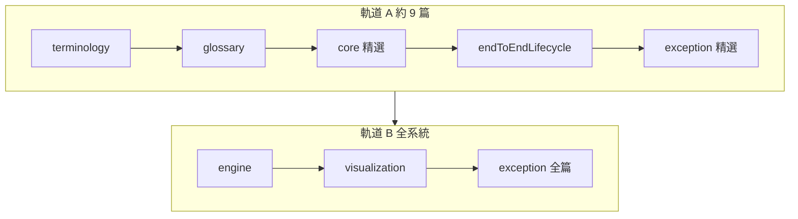

# 📊 SPC 學習路徑

本章節只做一件事：依你的目標選**閱讀軌道**——零基礎先走軌道 A，要設計系統再走軌道 B。

## 讀完本系列你能做什麼

| 軌道 | 讀者 | 能力 |
|------|------|------|
| **A** | 品保、新手 | 讀雙圖、懂 OOC/OOS、參與除錯對話 |
| **A+B** | 開發者、架構師 | 設計 ETL、計算/規則引擎、異常閉環 |

**先修知識：無。** 從 [`terminology`](./terminology.md) 的車庫比喻開始。

## 雙軌總覽

## 軌道 A：零基礎入門

| 順序 | 文章 | 讀完能回答 |
|------|------|-----------|
| 1 | [基礎理論與名詞解釋](./terminology.md) | SPC 最小概念閉環 |
| 2 | [快速術語表](./glossary.md) | 縮寫速查 |
| 3 | [管制界限與規格界限](./core-model/control-vs-spec-limits.md) | 兩種線差在哪 |
| 4 | [雙圖哲學](./core-model/dual-chart-philosophy.md) | 為何看兩張圖 |
| 5 | [判讀規則](./core-model/decision-rules.md) | 不出界也算 OOC？ |
| 6 | [端到端資料生命週期](./core-model/endToEndLifecycle.md) | 數據怎麼走完 |
| 7 | [異常偵測與告警](./exception-handling/detection-and-alert.md) | 告警怎麼觸發 |
| 8 | [異常處置狀態機](./exception-handling/disposition-state-machine.md) | 怎麼結案 |
| 9 | [看圖與除錯入門](./exception-handling/spcDebugging.md) | 虛警怎麼查 |
| 選讀 | [高階統計圖表](./visualization/advanced-charts.md) | 直方圖何時用 |

## 軌道 B：系統實作（入門後）

### 核心領域模型

| 文章 | 主題 |
|------|------|
| [監控策略與分群](./core-model/monitoring-strategy.md) | 統計學為何分群 |
| [雙圖哲學](./core-model/dual-chart-philosophy.md) | 架構分離 |
| [管制 vs 規格](./core-model/control-vs-spec-limits.md) | 界限博弈 |
| [判讀規則](./core-model/decision-rules.md) | Nelson 語意 |
| [數據快照](./core-model/data-snapshot.md) | SpcHis / SpcOocHis |
| [端到端生命週期](./core-model/endToEndLifecycle.md) | 全流程 |

### 計算引擎

| 文章 | 主題 |
|------|------|
| [資料擷取與彙總](./engine/data-collection.md) | Raw / Monitor |
| [統計計算引擎](./engine/calculation-engine.md) | 界限、Cpk |
| [進階計算](./engine/advanced-calculation.md) | 非常態、重判 |
| [監控計畫路由](./engine/monitoring-plan.md) | Wildcard |
| [規則引擎](./engine/rule-engine.md) | 滑動窗口 |
| [配置變更](./engine/configuration-management.md) | 版本化 |

### 視覺化

| 文章 | 主題 |
|------|------|
| [圖層渲染](./visualization/layer-rendering.md) | ChartDirector |
| [數據採樣](./visualization/data-sampling.md) | LTTB |
| [深度下鑽](./visualization/drill-down.md) | 三層 RCA |
| [高階圖表](./visualization/advanced-charts.md) | 直方圖等 |
| [報表自動化](./visualization/report-automation.md) | 焦點報告 |

### 異常處理

| 文章 | 主題 |
|------|------|
| [異常偵測](./exception-handling/detection-and-alert.md) | 原子性 |
| [告警抑制](./exception-handling/alert-suppression.md) | 歸併升級 |
| [處置狀態機](./exception-handling/disposition-state-machine.md) | OCAP |
| [MES 聯動](./exception-handling/cross-system-integration.md) | Hold Lot |
| [通報可靠性](./exception-handling/notification-reliability.md) | 重試備援 |
| [除錯入門](./exception-handling/spcDebugging.md) | 虛警 |

## 本系列不涵蓋

- 統計教科書級推導
- 各廠 MES 介面差異
- ChartDirector API 細節

## 快速查詢

| 需求 | 文章 |
|------|------|
| 不懂縮寫 | [glossary](./glossary.md) |
| 看全流程 | [endToEndLifecycle](./core-model/endToEndLifecycle.md) |
| 現場虛警 | [spcDebugging](./exception-handling/spcDebugging.md) |