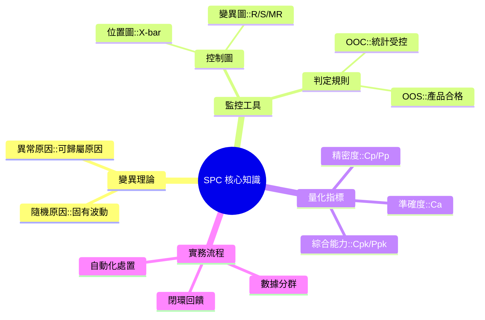
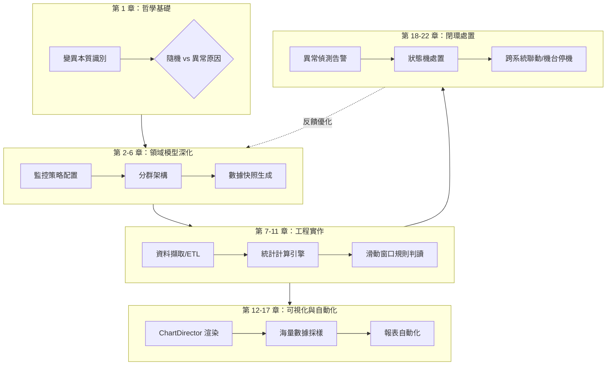

# 📊 基礎理論與名詞解釋

本章節旨在為讀者建立製程統計控制 (Statistical Process Control, SPC) 的完整知識體系。無論讀者背景為何，透過本篇深度解析，將能從基礎統計學概念跨越至半導體高階製造的品質管理思維。

---

## 🎯 學習目標

完成本章閱讀後，您將能夠：
1.  **區分變異來源**：準確辨識「隨機原因」與「異常原因」對生產線的不同意義。
2.  **解讀控制圖**：理解中心線、管制界限與規格界限的本質差異。
3.  **評估製程能力**：掌握 $C_p, C_a, C_{pk}$ 的數學邏輯及其在商業決策中的應用。
4.  **掌握系統全局**：理解數據從採集、計算、判定到處置的完整閉環流程。

---

## 🏎️ 核心觀念：車庫停車比喻 (The Garage Analogy)

在進入複雜公式前，請想像一個場景：**「將車子停進車庫」**。
- **車庫的寬度 (USL - LSL)**：代表客戶給你的「容忍空間」。
- **車子的寬度 (6σ)**：代表你的製程「佔用的空間」（波動大小）。
- **停在哪裡 (μ)**：代表你的製程「中心點」。

透過這個比喻，我們能輕易理解以下指標：
1.  **$C_p$ (製程精密度)**：你的車子是否**夠窄**？如果車子比車庫寬，技術再好也停不進去。
2.  **$C_a$ (製程準確度)**：你是否把車子**停在正中間**？還是快撞到左邊牆壁了？
3.  **$C_{pk}$ (綜合能力)**：考慮了車子寬度與停車位置，你最後**是否會刮傷車漆**？

---

## 🧠 知識架構心智圖

---

## 🔄 SPC 系統運行全景圖

在深入細節前，請先理解本手冊涵蓋的技術全景：

---

## 🛡️ 核心哲學：預防勝於治療 (Prevention vs. Detection)

這是 SPC 系統存在的商業邏輯。

| 模式 | 做法 | 成本評級 | 結果 |
| :--- | :--- | :--- | :--- |
| **事後偵測 (Inspection)** | 產品做完後再檢查是否合格 | ❌ 高 (100x) | 發現廢品時，損害已造成，只能報廢或重工。 |
| **事前預防 (SPC)** | 監控製程的「穩定性」，在變異發生初期介入 | ✅ 低 (1x) | 在廢品產生前就修正機台，保持高品質產出。 |

### 📊 品質成本的 1:10:100 法則
- **1 元 (預防)**：在 SPC 發現趨勢時調整參數的成本。
- **10 元 (重工)**：產品做壞了，在廠內發現並修復的成本。
- **100 元 (保固)**：廢品流向客戶，導致退貨、賠償與品牌受損的成本。

---

## 1. 核心哲學：變異的本質 (The Nature of Variation)

在工業生產中，沒有任何兩個產品是完全相同的。這種差異性稱為「變異」。

### 1.1 隨機原因 (Common Cause) —— 「正常的呼吸」
- **定義**：製程中固有的、不可避免的波動。例如：環境溫度的微小起伏、設備的自然震動。
- **特性**：穩定、可預測，且呈現常態分佈。
- **管理意義**：就像人的呼吸一樣，雖然有起伏但很規律。改善此類變異通常需要更換設備或改變製程設計。

### 1.2 異常原因 (Special Cause) —— 「感冒咳嗽」
- **定義**：由特定、可辨識的因素引起的變異。例如：操作員錯誤、材料批次瑕疵、設備零件損壞。
- **特性**：不穩定、不可預測。
- **管理意義**：這是「不正常」的訊號。SPC 系統的主要目標即是**偵測並消除**異常原因，使製程回歸受控。

---

## 2. 數據分群與抽樣 (Subgrouping & Sampling)

統計學是透過「樣本」推論「母體」的過程。

### 2.1 樣本組 (Subgroup)
- **定義**：在極短時間內產出的產品集合。
- **理性分群 (Rational Subgrouping)**：設計分群的原則是使「組內變異」僅包含隨機原因（呼吸），而「組間變異」則用來偵測異常原因（咳嗽）。

### 2.2 樣本數 (Sample Size, $n$)
- 每一組樣本中包含的量測點數量。在 X-bar 圖中，$n$ 通常設定為 $3$ 到 $5$。

---

## 3. 控制圖的構造：製程的聲音 vs. 客戶的聲音

### 3.1 管制界限 (UCL/LCL) —— 「機台的實力自白」
- **定義**：由製程本身的數據計算而來的邊界。
- **$\pm 3\sigma$ 原則**：機台告訴你：「在正常情況下，我的表現就在這兩條線之間。」
- **區分點**：管制界限反映的是製程的**「真實表現」**，而非「預期需求」。

### 3.2 規格界限 (USL/LSL) —— 「客戶的嚴格要求」
- **定義**：由工程設計或客戶需求定義的邊界，代表產品的「合格範圍」。
- **區分點**：規格界限與管制界限無關。**產品在規格內未必代表製程受控；反之，製程受控也未必代表產品合格。**

---

## 4. 製程能力指標 (PCI)：從潛力到現實

### 4.1 $C_p$ (Process Capability) —— 「理想中的極限潛力」
- **物理意義**：衡量製程的「分佈寬度」是否小於「規格寬度」。
- **公式**：
  $$C_p = \frac{USL - LSL}{6\sigma}$$
- **白話解釋**：假設你把車子停在正中間，你的車子到底有多寬？$C_p > 1.33$ 代表車子很窄，兩邊還有很多空間。

### 4.2 $C_a$ (Process Accuracy) —— 「瞄準目標的精確度」
- **物理意義**：衡量製程中心與規格中心（Target）的偏離程度。
- **白話解釋**：你停車時偏離正中央多少？$0$ 代表完美正中，$1$ 代表你已經撞牆了。

### 4.3 $C_{pk}$ (Process Capability Index) —— 「現實中的真實表現」
- **物理意義**：同時考慮精密度與準確度.
- **白話解釋**：這才是真正的良率指標。就算你的車子很窄 ($C_p$ 很高)，但如果你停得太歪，你還是會撞牆 ($C_{pk}$ 低)。
- **計算原則**：看哪邊離牆壁比較近，就拿那一邊來計算：
  $$C_{pk} = \min \left( \frac{USL - \mu}{3\sigma}, \frac{\mu - LSL}{3\sigma} \right)$$

---

## 5. 進階概念：$C_p$ vs. $P_p$ (技術極限 vs. 生產現實)

### 5.1 $C_p / C_{pk}$ (短期能力) —— 「最好的你」
- **計算基準**：組內變異 ($\sigma_{\text{within}}$)。
- **物理意義**：想像機台在 10 分鐘內產出的產品。環境沒變、材料沒變、操作員沒變。這代表製程的**「技術極限」**。

### 5.2 $P_p / P_{pk}$ (長期能力) —— 「真實的你」
- **計算基準**：全體變異 ($\sigma_{\text{overall}}$)。
- **物理意義**：考慮一個月內的生產，包含白晚班、氣溫變化、材料更換。這代表客戶最後收到的**「真實良率」**。

---

## 6. 異常判定規則 (Decision Rules) —— 誰在求救？

如何判定製程已經脫離受控？

### 6.1 OOC (Out of Control) —— 「統計受控」失敗
- **出界 (Out of Limits)**：數據點落在 UCL 以上 or LCL 以下。
- **非隨機模式 (Non-random Patterns)**：例如連續 9 點在中心線同一側、連續 6 點遞增或遞減。這代表系統已發生偏移 (Shift) 或趨勢 (Trend)。

### 6.2 OOS (Out of Specification) —— 「產品合格」失敗
- 數據點超出 USL 或 LSL，代表產品已產生實質缺陷，屬於廢品。

---

## 7. 進階統計術語 (Advanced Statistics)

### 7.1 常態性檢定 (Normality Test)
- 驗證數據是否符合鐘形曲線分佈。若數據不符合常態（非常態），則基於 $3\sigma$ 的計算將會失效，需改用**分位數法**。

### 7.2 組內變異 vs. 全體變異 (Within vs. Overall)
- **組內變異 ($\sigma_{\text{within}}$)**：計算 $C_{pk}$ 的基礎，反映製程的瞬時能力。
- **全體變異 ($\sigma_{\text{overall}}$)**：計算 $P_{pk}$ 的基礎，反映製程的長期穩定性。

---

## 8. 結語：專家的決策循環

一名 SPC 領域專家應具備以下思維：
1. **看圖不看數**：如果控制圖點位亂跳，算出來的 $C_{pk}$ 都沒有意義（基礎不穩）。
2. **先穩定後優化**：先把車子變窄（縮小波動），再去調整停車位置（對準中心）。
3. **區分目標與現實**：隨時校準規格界限（客戶要的）與管制界限（機台給的）的鴻溝。
