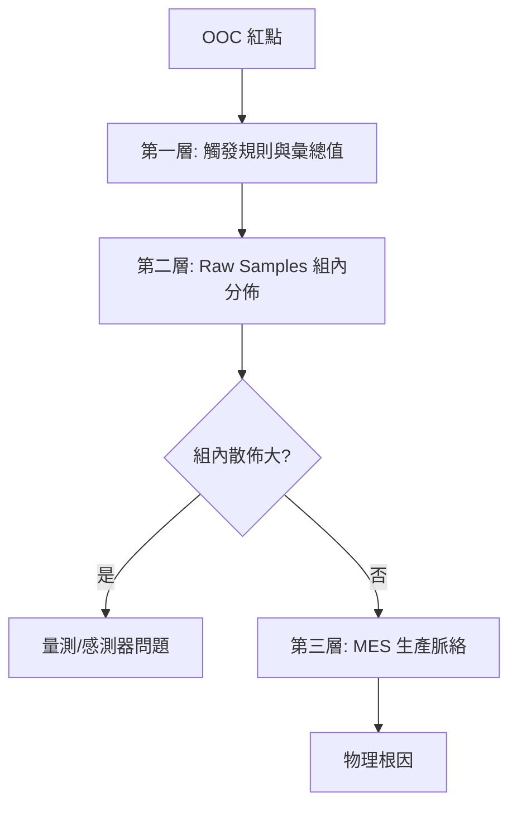

# 📊 深度下鑽與互動分析

本章節只做一件事：說明發現 OOC 紅點後，如何從彙總值一路鑽到 Raw Sample 與 MES 脈絡。雙圖概念見 [`dual-chart-philosophy`](../core-model/dual-chart-philosophy.md)。

## 讀完本篇你能回答

- OOC 根因分析的三層路徑是什麼？
- 怎麼區分量測噪聲 vs 製程偏移？
- X-bar 與 R 圖如何聯動？

## 1. 三層下鑽

| 層級 | 看到什麼 |
|------|----------|
| 1 | $\bar{X}$、$R$、觸發規則 |
| 2 | 組內分佈、Wafer Map |
| 3 | 機台、操作員、環境紀錄 |

## 2. 局部重估

框選 ROI 可即時重算該區間的 $C_{pk}$ 與 $\bar{\bar{X}}$，評估改善是否顯著。

## 3. 跨圖聯動

點選 X-bar 異常點 → R 圖同步跳轉同一時刻；多量測項同步時間軸比對。

:::info 實務提醒
可暫時隱藏疑似壞點觀察 Cpk 變化（排除法），但正式結案需走 Excluded 流程見 [`disposition-state-machine`](../exception-handling/disposition-state-machine.md)。
:::

## 延伸閱讀

| 主題 | 文章 |
|------|------|
| 快照資料 | [`data-snapshot`](../core-model/data-snapshot.md) |
| 高階圖表 | [`advanced-charts`](./advanced-charts.md) |
| 除錯入門 | [`spcDebugging`](../exception-handling/spcDebugging.md) |