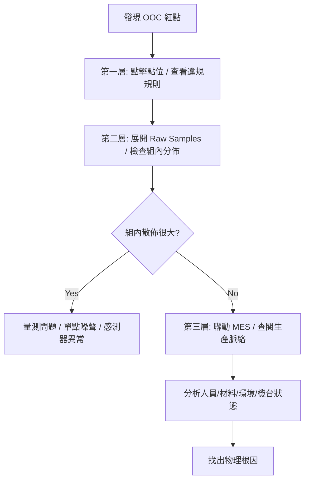

# 📊 深度下鑽與互動分析

本章節解析視覺化系統的「分析深度」。發現異常只是開始，真正的價值在於具備穿透數據層級的能力，幫助工程師找出問題根因。

## 1. 三層式分析路徑 (Three-Layer Analysis Path)

### 📊 實務路徑：OOC 根因分析流程圖

### 第一層：觀測彙總
- **內容**：顯示該組彙總數據 ($\bar{X}, R, S$) 與觸發規則。

### 第二層：原始樣本 (Raw Samples)
- **視覺化工具**：系統呈現「組內分佈圖」或晶圓座標圖 (Wafer Map)。
- **分析價值**：區分「組內變異」與「系統性位移」。

### 第三層：生產脈絡 (Drill-through)
- **內容**：聯動 MES，獲取該批次的生產環境數據（機台、操作員、溫濕度等）。

## 2. 局部縮放與統計重估

- **局部縮放**：支持框選 ROI。
- **即時重判**：針對局部區間重新計算 $C_{pk}$ 與 $\bar{\bar{X}}$。幫助工程師評估品質改善是否顯著。

## 3. 跨圖表聯動分析 (Linked Views)

- **位置與變異圖同步**：選取 $\bar{X}$ 異常點時，$R$ 圖自動跳轉至相同時間點。
- **多維度同步**：在不同量測項目間同步時間軸，分析指標間的關聯。

## 4. 領域專家思維：假設驗證

- **排除法分析**：臨時「隱藏」疑似錯誤點，即時查看對 $C_{pk}$ 的影響。
- **預測性縮放**：預測數據何時會突破規格界限。
