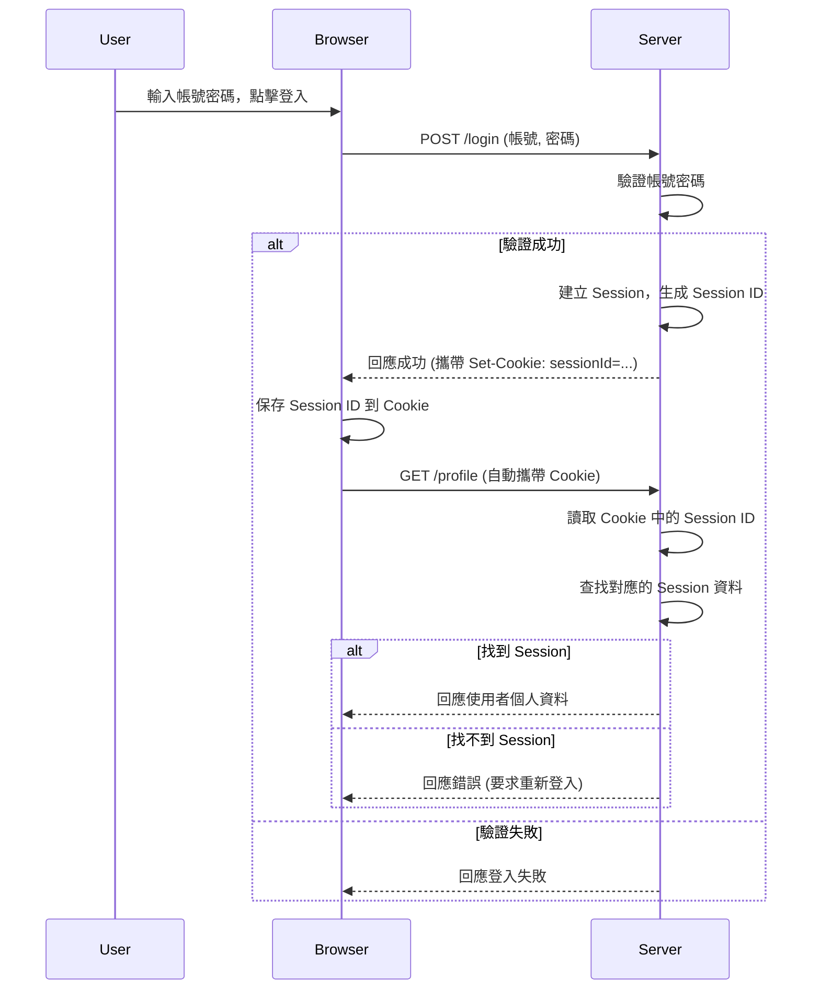
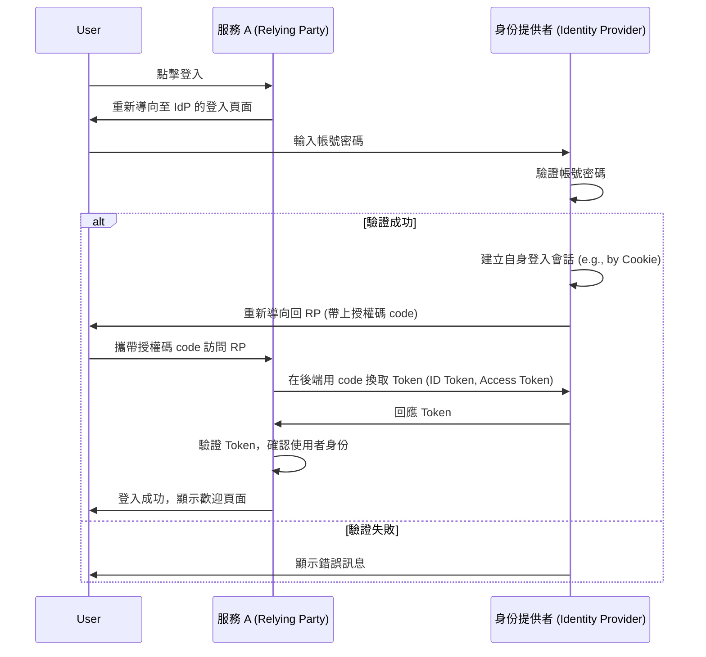
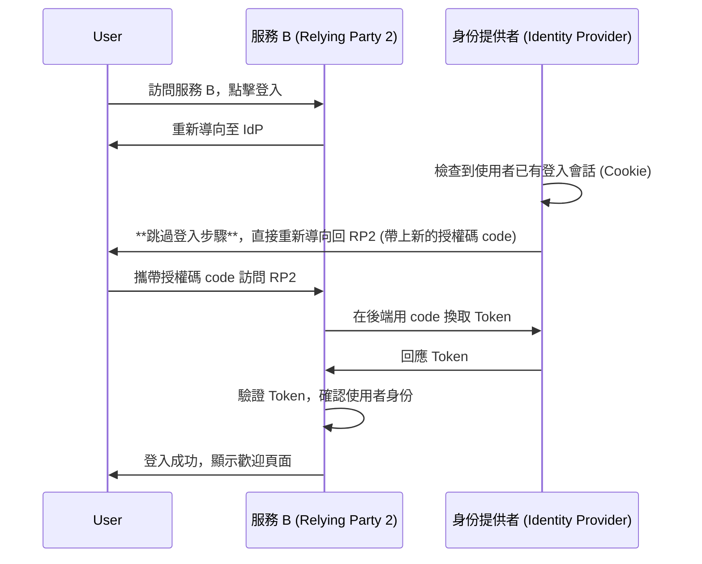
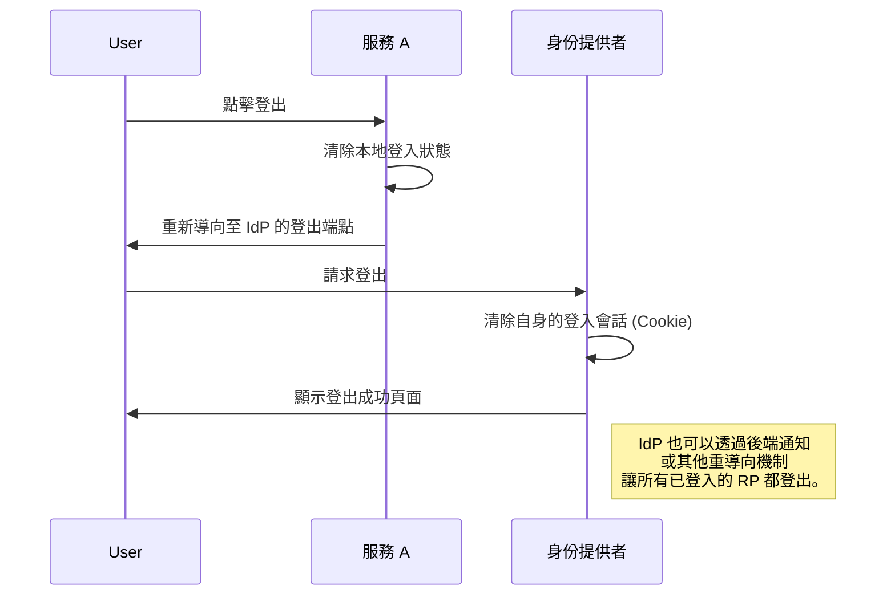

# 🔐 SSO 概觀

## 關於 SSO

> SSO (Single Sign-On): 單點登入
>
> 是一種身份驗證和授權機制，允許使用者僅需一次登入，然後就能訪問多個相關的應用程式和服務，而無需再次輸入其認證資訊
>
> SSO 提供了方便性和安全性，並提高了使用者體驗

# 🔐 SSO 概觀

## 關於 SSO

> SSO (Single Sign-On): 單點登入
>
> 是一種身份驗證機制，允許使用者僅需一次登入，就能訪問多個互相信任的應用程式，而無需為每個應用程式重複輸入認證資訊。SSO 旨在提升使用者便利性與系統安全性。

## 傳統登入方式 (Session-Cookie)

在理解 SSO 之前，我們先回顧傳統的、單一系統的登入方式。

### 傳統登入方式的角色

-   **使用者 (User)**：希望登入應用程式的人。
-   **瀏覽器 (Browser)**：使用者與後端伺服器互動的介面。
-   **後端伺服器 (Server)**：負責驗證使用者身份並管理會話 (Session)。

### 傳統登入方式流程說明

1.  使用者在瀏覽器輸入帳號密碼，發送登入請求至後端伺服器。
2.  伺服器驗證使用者提供的資訊是否正確。
3.  驗證成功後，伺服器執行以下操作：
    -   在伺服器端建立一個「會話 (Session)」，用來儲存使用者的登入狀態。
    -   產生一個獨一無二的 `Session ID`，並將其透過 `Set-Cookie` 標頭傳回給瀏覽器。
4.  瀏覽器收到回應後，會將 `Session ID` 儲存在 Cookie 中。
5.  在後續的每個請求中，瀏覽器都會自動攜帶包含 `Session ID` 的 Cookie。
6.  伺服器收到請求後，讀取 Cookie 中的 `Session ID`，並在自身的 Session 儲存區中查找對應的會話資料，從而確認使用者身份。
7.  如果找不到或會話已過期，則視為未登入。

### 傳統登入方式流程圖

### 傳統登入在多系統下的瓶頸

這種緊密依賴伺服器端 Session 的方式在分散式或微服務架構中會遇到瓶頸：

1.  **Session 無法共享**：每個服務都有自己的 Session 儲存區，無法互通。使用者在系統 A 登入後，訪問系統 B 時仍會被視為未登入。
2.  **Cookie 無法跨主域**：瀏覽器的安全機制限制 Cookie 只能在同一個主域名下傳遞，無法在 `a.com` 和 `b.com` 之間共享。

為了解決這些問題，SSO 應運而生。

## SSO 原理 (以 OIDC 為例)

現代 SSO 主要基於如 **OpenID Connect (OIDC)** 或 **SAML** 等標準協定。OIDC 建立在 OAuth 2.0 之上，是目前最主流的 Web SSO 解決方案。

### OIDC 的核心角色

-   **使用者 (User)**：操作瀏覽器的人。
-   **使用者代理 (User-Agent)**：即瀏覽器。
-   **身份提供者 (Identity Provider, IdP)**：負責驗證使用者身份的專門服務，也就是我們的 SSO 系統。
-   **依賴方 (Relying Party, RP)**：信任 IdP 並依賴其進行身份驗證的應用程式，也常被稱為服務提供者 (Service Provider, SP)。

### OIDC 登入流程圖 (首次登入)

### SSO 流程圖 (已登入狀態下訪問另一服務)

當使用者已經在 IdP 登入後，訪問另一個應用程式的流程變得非常無縫。

### SSO 登出流程圖 (Single Logout, SLO)

單點登出確保使用者在任何一個應用程式登出後，所有其他應用程式的登入狀態也一併失效。

---

REF:

-   [看完这篇你不能再说不懂SSO原理了！](https://www.cnblogs.com/qdhxhz/p/17007958.html)
-   [OpenID Connect (OIDC) Core Specification](https://openid.net/connect/)
