# 🔐 SSO 概觀

## 關於 SSO

> SSO (Single Sign-On): 單點登入
>
> 是一種身份驗證和授權機制，允許使用者僅需一次登入，然後就能訪問多個相關的應用程式和服務，而無需再次輸入其認證資訊
>
> SSO 提供了方便性和安全性，並提高了使用者體驗

## SSO 適用場景

單點登入可應用於各種情境，包括：

- 企業內部環境：在企業內部，使用者可以通過一個登入頁面訪問所有內部應用程式，而無需為每個應用程式都提供不同的認證
- 多個網站或應用程式：當一個組織擁有多個網站或應用程式時，SSO 允許使用者在這些網站或應用程式之間共享相同的登入狀態，以方便他們的訪問
- 雲端服務：SSO 適用於使用各種雲端服務的情境，例如電子郵件、文件共享、專案管理等使用者只需一次登入，即可訪問這些服務，而無需多次輸入密碼

> SSO 提供了集中的身份驗證和授權，並減少了對多個登入認證的需求，同時提供了更好的安全性和管理性它簡化了使用者的登入體驗，同時有助於組織維護和監控訪問權限

## 傳統登入方式

### 傳統登入方式的角色

- 使用者：應用程序的使用者，希望進行登入
- 瀏覽器：使用者使用的網頁瀏覽器，用於向後端伺服器發送請求和處理回應
- 後端伺服器：應用程序的伺服器端，負責處理使用者的登入請求並進行身份驗證

### 傳統登入方式流程說明

1. 使用者開始登入過程，向後端伺服器發送登入請求
2. 後端伺服器接收登入請求後，開始驗證使用者提供的資訊
3. 驗證成功的情況下，後端伺服器向瀏覽器回應首次登入驗證成功的訊息
4. 瀏覽器接收到成功的回應後，執行以下操作：
   - 儲存使用者資訊在 Session 中
   - 設定 Set-Cookie 欄位，寫入 SessionId 等資訊，設定過期時間，建立 Cookie
   - 瀏覽器保存Cookie資訊
5. 當使用者進行後續請求時，瀏覽器會自動附加 Cookie 資訊到請求中
6. 後端伺服器接受後續請求，從請求標頭中取出 SessionId
7. 後端伺服器使用 SessionId 從伺服器 Session 中取得使用者資訊
8. 根據取得的使用者資訊，後端伺服器執行以下操作：
   - 如果成功取得使用者資訊，則回應 `已登入` 的訊息給使用者
   - 如果未能成功取得使用者資訊，則回應 `未登入` 的訊息給使用者
9. 如果在初始驗證階段驗證失敗，後端伺服器直接回應 `登入驗證失敗` 的訊息給使用者

### 傳統登入方式流程圖

```mermaid
sequenceDiagram
    participant 使用者 as 使用者
    participant 瀏覽器 as 瀏覽器
    participant 後端 as 後端伺服器

    使用者->>後端: 發送登入請求
    後端->>後端: 驗證使用者資訊
    alt 驗證成功
        後端-->>瀏覽器: 首次登入驗證成功
        瀏覽器->>瀏覽器: 儲存使用者資訊在Session中
        瀏覽器->>瀏覽器: 設定Set-Cookie欄位，寫入 SessionId 等資訊，設定過期時間，建立Cookie
        瀏覽器->>瀏覽器: 瀏覽器保存Cookie資訊
        瀏覽器->>後端: 其他介面請求時，瀏覽器自動附加Cookie資訊
        後端->>後端: 後端接受請求，從請求標頭中取出 SessionId 
        後端->>後端: 從伺服器Session中取得使用者資訊
        alt 取得成功
            後端-->>後端: 登入驗證成功
            後端-->>使用者: 已登入
        else 取得失敗
            後端-->>後端: 登入驗證失敗
            後端-->>使用者: 未登入
        end
    else 驗證失敗
        後端-->>使用者: 登入驗證失敗
    end
```

### 傳統登入多系統的瓶頸

> 在單體的系統中，登入結合了 `Cookie` 與 `Session`
>
> 在多系統登入之下會有碰到兩個瓶頸

1. `Session` 無法共享
2. `Cookie` 無法跨域

在多系統情況下，服務器端 Session 不共享，這意味著當用戶在不同系統之間切換時，他們的 Session 數據不會共享，這可能會導致登入狀態的丟失

### 解決 Session 無法共享

> 有三種常見的方式來解決 Session 無法共享的問題

1. Session 拷貝：
    - 當其中服務對 Session 中的資訊進行修改時，這些修改將同步給其他服務，以實現Session共享
    - 缺點：可能會增加伺服器端的壓力和可能的延遲
2. 使用 Redis：
   - 它具有高效的存儲和查詢能力，並支持數據持久化，不易丟失資料
3. 使用 JWT（JSON Web Tokens）：
   - 服務只需成功解析 JWT，就可以獲取使用者的資訊
   - 前端 Cookie 只需要存儲JWT，而不需要查詢服務的 Session

## SSO 原理

### 核心成員 - 應用系統

- **應用系統**（Application System）：
  - 這是需要身份驗證的目標系統，用戶希望訪問的應用程式
  - 應用系統可能包括網站、應用程式或其他服務，並需要用戶通過 SSO 進行身份驗證，以確保只有授權的用戶可以訪問它

### 核心成員 - 客戶端

- **SSO 客戶端**（SSO Client）：
  - SSO 客戶端負責處理用戶的登入和登出
  - 並與 SSO 服務端進行通信以驗證用戶的身份

### 核心成員 - 服務端

- **SSO 服務端**（SSO Server）：
- 通常包括以下子角色：
  - **登入服務**：負責處理用戶的身份驗證和生成 token（例如，JWT）以證明用戶的身份
  - **登入狀態服務**：提供了驗證用戶的登入狀態和登入訊息查詢的服務
  - **退出服務**：用戶注銷服務，允許用戶登出 SSO 系統

### 核心成員 - 資料庫

- **資料庫**（Database）：
  - 這是用於存儲使用者資訊的地方

### 核心成員 - 快取

- **快取**（Cache）：
  - 這是用於存儲用戶的登入訊息的系統，通常使用 Redis 或類似的快取存儲
  - 它用於提高性能，減少對數據庫的查詢，以驗證用戶的登入狀態

### SSO 流程圖 - 登入

```mermaid
sequenceDiagram
    participant User
    participant Service
    participant SSO Provider

    User ->> SSO Provider: 登入請求
    SSO Provider ->> User: 提示登入
    User ->> SSO Provider: 提供認證
    SSO Provider -->> SSO Provider: 驗證認證
    SSO Provider -->> User: 登入成功
    User ->> Service: 存取受保護的服務
    Service -->> SSO Provider: 檢查驗證
    SSO Provider -->> Service: 驗證成功
    Service -->> User: 存取授權
```

### SSO 流程圖 - 登入第二服務

```mermaid
sequenceDiagram
    participant User
    participant Service1
    participant Service2
    participant SSO Provider

    User ->> SSO Provider: 登入請求
    SSO Provider ->> User: 已登入
    User ->> SSO Provider: 提供認證
    SSO Provider -->> SSO Provider: 驗證認證
    SSO Provider -->> User: 登入成功
    User ->> Service1: 存取受保護的服務1
    Service1 -->> SSO Provider: 檢查驗證
    SSO Provider -->> Service1: 驗證成功
    Service1 -->> User: 存取授權1

    User ->> SSO Provider: 登入請求 (第二系統)
    SSO Provider ->> User: 已登入
    User ->> SSO Provider: 提供認證 (第二系統)
    SSO Provider -->> SSO Provider: 驗證認證 (第二系統)
    SSO Provider -->> User: 登入成功 (第二系統)
    User ->> Service2: 存取受保護的服務2
    Service2 -->> SSO Provider: 檢查驗證 (第二系統)
    SSO Provider -->> Service2: 驗證成功 (第二系統)
    Service2 -->> User: 存取授權2
```

### SSO 流程圖 - 登出

```mermaid
sequenceDiagram
    participant User
    participant Service1
    participant Service2
    participant SSO Provider

    User ->> SSO Provider: 登出請求
    SSO Provider ->> User: 確認登出
    SSO Provider ->> Service1: 通知登出
    SSO Provider ->> Service2: 通知登出
    Service1 ->> SSO Provider: 確認登出
    Service2 ->> SSO Provider: 確認登出
    SSO Provider -->> User: 登出成功
    User -->> Service1: 登出
    User -->> Service2: 登出
```

